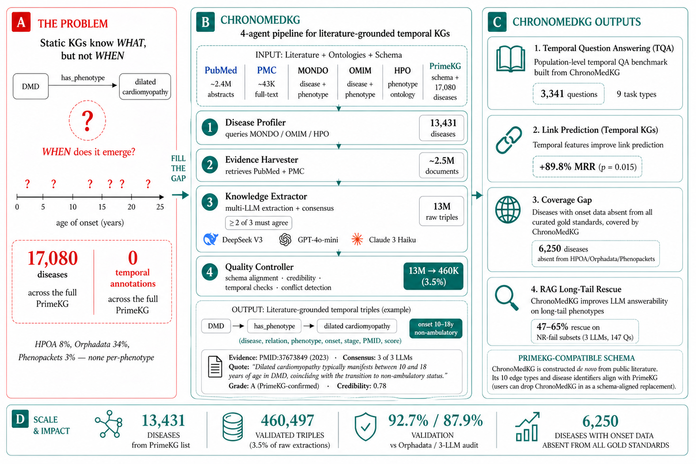

# ChronoMedKG

> A temporally-grounded, evidence-graded biomedical knowledge graph and benchmark.

This repository contains the **construction pipeline and experiment scripts** for ChronoMedKG. The dataset itself (validated triples, ChronoTQA benchmark, audit artifacts) is archived separately on Zenodo.

- **Paper**: ChronoMedKG: A Temporally-Grounded, Evidence-Graded Biomedical Knowledge Graph and Benchmark for Temporal Clinical Reasoning (NeurIPS 2026 Evaluations & Datasets Track, under review).
- **Dataset**: [zenodo.org/records/19697543](https://zenodo.org/records/19697543) (CC BY 4.0)
  - Concept DOI: [10.5281/zenodo.19697542](https://doi.org/10.5281/zenodo.19697542)
  - Version DOI (v0.0.1): [10.5281/zenodo.19697543](https://doi.org/10.5281/zenodo.19697543)
- **Code**: this repository (MIT)

## What ChronoMedKG is

460,497 validated consensus triples derived from running a four-agent disease-autonomous pipeline across 13,431 of PrimeKG's 17,080 diseases (78.6%). Every edge carries:

- per-phenotype onset window or progression stage,
- PMID-traceable verbatim evidence,
- six-signal credibility score.

10,852 of those 13,431 diseases have at least one validated triple after multi-LLM consensus and Quality Controller filtering.

ChronoMedKG ships paired with **ChronoTQA**, the first temporal biomedical QA benchmark (3,341 questions across eight reported task types).

## Quickstart

Download the validated triples from Zenodo and inspect a few records:

```python
import json, urllib.request

url = "https://zenodo.org/records/19697543/files/validated_triples.jsonl"
urllib.request.urlretrieve(url, "validated_triples.jsonl")  # 527 MB

with open("validated_triples.jsonl") as f:
    for i, line in enumerate(f):
        if i >= 3: break
        t = json.loads(line)
        print(f"{t['source_name']} --[{t['relation']}]--> {t['target_name']}")
        print(f"  onset: {t['temporal']['onset_age_min']}–{t['temporal']['onset_age_max']} years")
        print(f"  PMIDs: {t['evidence']['source_ids'][:3]}  credibility: {t['evidence']['credibility_score']:.2f}")
```

ChronoTQA benchmark (`tqa_benchmark.json`, 3.2 MB) sits at the same record. The full Zenodo deposit lists all six release files.

## Pipeline architecture



The orchestrator drives four agents end-to-end from a disease identifier:

1. **Disease Profiler** queries MONDO / OMIM / Orphanet for ontology-grounded metadata and a literature-coverage tier (Standard ≥100 articles, Light 20–99, Minimal <20).
2. **Evidence Harvester** retrieves PubMed abstracts and PMC Open Access full-text via NCBI E-utilities; up to 150 documents for Standard-tier diseases, all available literature for sparse-literature rare diseases.
3. **Knowledge Extractor** runs three frontier LLMs in parallel (DeepSeek V3, GPT-4o-mini, Claude 3 Haiku); a candidate triple is retained only if at least two models extract it from the same document with entity fuzzy match ≥80% and the same canonical relation.
4. **Quality Controller** aligns to PrimeKG schema, scores six-signal credibility, applies temporal-plausibility checks, and emits the validated subgraph.

## Repository layout

```
agents/                  4-agent pipeline + orchestrator
  base_agent.py            Shared retry / logging / metrics base
  disease_profiler.py      Agent 1: ontology-grounded disease profiling
  evidence_harvester.py    Agent 2: PubMed + PMC literature retrieval
  knowledge_extractor.py   Agent 3: multi-LLM consensus extraction
  quality_controller.py    Agent 4: PrimeKG alignment + credibility + plausibility
  orchestrator.py          End-to-end controller (--workers, --max-docs, --no-resume)
core/                    Shared modules
  models.py                Data classes for triples + temporal metadata
  schema_alignment.py      PrimeKG relation mapping
  credibility_scorer.py    Six-signal paper credibility
  temporal_reasoner.py     Temporal scope inference
  entity_normalizer.py     SapBERT + scispaCy UMLS
  batch_llm.py             Async multi-model extraction
config/
  default.yaml             Global defaults
  diseases_examples/       10 sample disease profile YAMLs (DMD, MG/LEMS, CIDP/GBS, etc.)
scripts/                 Experiment + utility scripts (see below)
evaluation/              ChronoTQA benchmark runner (placeholder)
tests/                   Test stubs
docs/                    Methodology notes + decision log + research notes
```

The full 15,828 disease profile YAMLs are not shipped here; they are regenerated by running the Disease Profiler agent against PrimeKG. The 10 included examples are representative of the temporal-pattern diversity in the resource.

## Reproducing key paper experiments

Each script reproduces a specific paper figure or table using the released Zenodo bundle.

| Paper artifact | Script |
|---|---|
| Section 3 — full pipeline run | `python3 agents/orchestrator.py --disease-id "OMIM:310200" --disease-name "Duchenne muscular dystrophy" --max-docs 200` |
| Section 4.1 / Table — three-LLM novel-coverage audit | `scripts/llm_judge_novelty_v2_multi.py` |
| Section 4.3 / Table — strict error taxonomy | `scripts/error_taxonomy_v2.py` |
| Section 5 — ChronoTQA generation | `scripts/build_tqa_v6.py` |
| Section 5 / Table — RAG long-tail rescue | `scripts/run_rag_experiment_v3.py` |
| Section 6.1 / Figure — coverage gap | `scripts/experiment_coverage_gap.py` |
| Section 6.2 / Figure — evidence-decay audit | `scripts/experiment_evidence_decay.py` |
| Section 6.3 / Figure — trajectory clustering | `scripts/experiment_trajectory_clustering.py` |
| Appendix — link-prediction TransE/DistMult ablation | `scripts/experiment_link_prediction_v4_sapbert.py` |
| Appendix — SapBERT canonicalisation pilot | `scripts/experiment_sapbert_canonicalize.py` |
| Numbers audit | `scripts/audit_critical_numbers.py` |
| Figure regeneration | `scripts/generate_paper_figures.py` |

## Environment

```bash
# Python 3.12; system anaconda or any 3.12 venv
pip install -r requirements.txt

# Optional: SapBERT entity normalizer (reuses the HEG-TKG environment)
# git clone the HEG-TKG companion repo for the .venv-sapbert
```

`requirements.txt` pins the 15 load-bearing packages (`openai==2.9.0`, `anthropic==0.75.0`, `rapidfuzz==3.14.3`, `torch==2.7.0`, etc.).

API keys are read from `.env`. Copy `.env.example` and fill in keys for the providers you intend to use. None of the keys are committed.

```bash
cp .env.example .env
# edit .env to add: OPENAI_API_KEY, ANTHROPIC_API_KEY, GOOGLE_API_KEY, DEEPSEEK_API_KEY, NCBI_API_KEY
```

## Random seeds

All experiments fix seeds where applicable:
- Link prediction: `{42, 7, 123}` (paired t-test)
- Novelty audit sampling: `42`
- TransE: embedding dim 100, 100 epochs, Adam lr 0.01

## Citation

If you use ChronoMedKG or ChronoTQA in your work, please cite:

```bibtex
@inproceedings{ahmed2026chronomedkg,
  title  = {ChronoMedKG: A Temporally-Grounded, Evidence-Graded Biomedical Knowledge Graph and Benchmark for Temporal Clinical Reasoning},
  author = {Ahmed, Md Shamim and others},
  booktitle = {Advances in Neural Information Processing Systems, Evaluations and Datasets Track},
  year   = {2026}
}
```

The companion HEG-TKG paper (which validates the extraction methodology on six rare neuromuscular diseases via clinician panel) is on arXiv at [arxiv.org/abs/2604.17114](https://arxiv.org/abs/2604.17114).

## Licenses

- **Code** (this repository): MIT — see `LICENSE-CODE`.
- **Data** (Zenodo bundle): CC BY 4.0 — see `LICENSE-DATA`.

Source databases retain their own licenses: PrimeKG (CC BY 4.0), HPOA (CC BY 4.0), Orphadata (CC BY-NC 3.0), GeneReviews (institutional), PMC Open Access (various). See `NOTICE` for the full attribution list.

## Maintainer

Md Shamim Ahmed — `shamim@imada.sdu.dk`. Issues and feature requests via the GitLab issue tracker on this repository.

## Project status

v0.0.1 is frozen as the bytes reviewed for the NeurIPS submission. Backlog for v1.1 (post-acceptance):
- SapBERT entity canonicalisation across phenotype names (3× entity-space compression)
- Backfill `citation_count` (NCBI E-utilities) and `is_retracted` (Retraction Watch) credibility signals
- Activate the GeneReviews/OMIM Deep tier (designed in the orchestrator, not triggered in v1.0)
- Refresh README + croissant.json inside the Zenodo deposit (currently match v0.0.1; see [decision_log.md](docs/decision_log.md))

## Disclaimer

ChronoMedKG is a literature-derived research artifact. It is not a clinical reference; do not deploy directly without expert clinician oversight. The paper documents a 7.3% genuine error rate by strict taxonomy (Section 4.3) and 11% qualitative-only temporal qualifiers without numeric onset bounds (Section 4.4). Released triples carry per-PMID provenance so users can verify every claim against the source literature.
